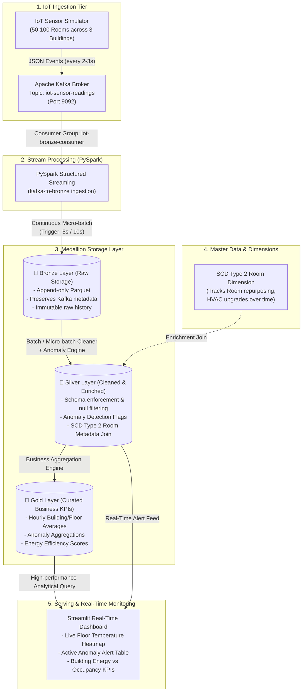

# 📡 IoT Smart Building Telemetry Pipeline: Architecture & Learning Blueprint

## 1. Executive Summary & Problem Context
Modern smart commercial buildings are equipped with thousands of Internet-of-Things (IoT) sensors continuously measuring **temperature**, **humidity**, **occupancy**, **power consumption**, and **air quality (CO2)**. Building facility managers face two critical operational challenges:
1. **Energy Inefficiency & Waste:** HVAC systems account for up to 40% of commercial building energy consumption. Rooms running climate control at full blast while unoccupied waste thousands of dollars monthly.
2. **Delayed Anomaly Response:** Critical equipment failures (e.g., HVAC compressor failure, server room overheating, water leakage) often go unnoticed until human occupants complain or equipment breaks down.

To solve this, we are building an **End-to-End Hybrid Streaming & Batch Medallion Data Pipeline** using **Apache Kafka**, **PySpark Structured Streaming**, **Delta / Parquet Lakehouse**, and an interactive **Streamlit Real-Time Operations Dashboard**.

---

## 2. High-Level System Architecture

---

## 3. Deep Dive: The Medallion Architecture

| Layer | Name | Purpose | Data State | Typical Queries |
| :--- | :--- | :--- | :--- | :--- |
| **🥉 Bronze** | Raw Landing | Ingest events as-is with raw fidelity from Kafka | Unvalidated, duplicate-tolerant, includes Kafka metadata (`offset`, `partition`, `timestamp`) | Re-processing, auditing, disaster recovery |
| **🥈 Silver** | Cleaned & Enriched | Cleansed, deduplicated, schema-validated, enriched with dimension tables & anomaly flags | Conformed, structured, validated, domain-enriched | Anomaly investigation, drill-down queries, feature engineering |
| **🥇 Gold** | Aggregated & Curated | Business metrics, aggregated rollups, and reporting KPIs | Aggregated by Hour/Day/Building/Floor, read-optimized | Executive dashboards, Power BI, Streamlit, automated alert triggers |

---

## 4. Key Engineering Concepts You Will Master in This Project

### A. Apache Kafka & Event Streaming
- **Why Kafka?** Traditional REST APIs struggle under high frequency sensor bursts. Kafka acts as a distributed, durable, high-throughput commit log that decouples producers (sensors) from consumers (Spark, monitoring).
- **Partitions & Consumer Groups:** Sensor messages are partitioned (e.g., keyed by `building_id`), enabling parallel distributed consumption while maintaining strict per-building event ordering.

### B. PySpark Structured Streaming & Checkpointing
- **Continuous Processing vs Micro-batch:** Structured Streaming processes streaming data as an unbounded table, updating results incrementally.
- **Fault Tolerance via Checkpointing:** Spark records the exact read offsets in a Write-Ahead Log (WAL) checkpoint directory, ensuring **at-least-once** or **effectively exactly-once** semantics upon failure recovery.

### C. Anomaly Detection Logic
1. **Sustained Overheating Alert:** Flag readings where `temperature > 30°C` sustained for $\ge$ 5 minutes (distinguishing temporary door openings from actual HVAC failures).
2. **Humidity Spike Alert:** Flag readings where `humidity > 80%` (potential water leak or HVAC condensation fault).
3. **Ghost Power / Energy Waste Alert:** Flag rooms where `energy_kw > 3.0 kW` while `occupancy == 0` (energy waste during vacant hours).

### D. Slowly Changing Dimensions (SCD Type 2)
In commercial real estate, rooms evolve over time (e.g., a standard meeting room is renovated into an IT Server Room with specialized cooling, or HVAC equipment is replaced).
- **SCD Type 2** retains full historical context by keeping previous records with `effective_start_date`, `effective_end_date`, and an `is_current` boolean flag. This ensures historical telemetry is joined against the room's configuration at the time the reading occurred, avoiding historical distortion.

---

## 5. Implementation Roadmap (Phases)

- **Phase 1: Environment Setup & Infrastructure Validation**
  - Verify Kafka & Zookeeper container health.
  - Setup Python 3.11 environment with PySpark, Kafka client, and Streamlit.
  - Create standardized folder structure (`src/`, `config/`, `data/`, `docker/`).

- **Phase 2: IoT Sensor Simulator & Kafka Producer**
  - Model realistic thermal dynamics, occupancy schedules (working hours vs night), and energy profiles across 50-100 rooms.
  - Implement configurable anomaly injection (HVAC freeze/heat runaway, power surge).
  - Stream events to Kafka topic `iot-sensor-readings`.

- **Phase 3: Bronze Layer Ingestion (PySpark Structured Streaming)**
  - Build PySpark consumer with robust schema parsing.
  - Write streaming micro-batches to Parquet Bronze lakehouse storage with checkpointing.

- **Phase 4: Silver Layer Processing & Anomaly Engine**
  - Data quality checks (null handling, out-of-range sensor clipping).
  - Multi-condition anomaly detection engine.
  - SCD Type 2 dimension model for building/room metadata.

- **Phase 5: Gold Layer Analytics & Aggregations**
  - Hourly building/floor KPI rollups (average temperature, max power, total occupant-hours).
  - Anomaly frequency and duration tracking.
  - Energy efficiency index ($kWh / occupant$).

- **Phase 6: Interactive Streamlit Dashboard**
  - Live floor plan heatmap (Room vs Temperature & Occupancy).
  - Active anomaly alert feed with severity levels (Critical / Warning).
  - Energy waste detector & building performance KPI cards.

- **Phase 7: End-to-End Testing & Verification**
  - Validate data flow across all stages.
  - Verify anomaly detection accuracy and real-time dashboard responsiveness.

- **Phase 8: Production Polish & Portfolio Presentation**
  - Comprehensive documentation, setup scripts, and resume-ready talking points.
